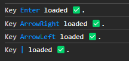

<h1 align='center'>
  UseKeyboard React
</h1>

<p align='center'>
  UseKeyboard is a lightweight, fully-typed React hook library for handling keyboard interactions declaratively. Instead of scattering <code>addEventListener</code> calls or <code>onKeyDown</code> handlers across your components, <code>useKeyboard</code> lets you define all your keyboard bindings in one configuration object. You specify which keys to listen for, what function to execute when they are pressed, and optionally restrict matches to specific modifier combinations (Ctrl, Shift, Alt, Meta). The hook supports listening on <code>keydown</code>, <code>keyup</code>, or both events simultaneously, and can be toggled on or off at runtime without unmounting. A <code>debug</code> mode logs each registered key to the console so you can verify your configuration at a glance, and <code>keysLoaded</code> is returned so you can inspect which keys are currently active. The library is zero-dependency (only React as a peer), tree-shakeable, and ships both ESM and UMD builds.
</p>

### Usage

#### NPM

```bash
npm install use-keyboard-react
```

#### YARN

```bash
yarn add use-keyboard-react
```

```jsx
import { useState } from "react";
import { useKeyboard } from "use-keyboard-react";
import "./App.css";

export const HomePage = (): JSX.Element => {
  const [count, setCount] = useState<number>(0);

  useKeyboard({
    config: {
      keys: [
        {
          key: "Enter",
          fn: () => console.log("Hi Enter"),
        },
        {
          key: "ArrowRight|ArrowLeft",
          fn: () => console.log("Hi Arrows Right and Left"),
        },
        {
          key: "a|b",
          fn: (e) => {
            if (e.key === "a") console.log("i am A");
            if (e.key === "b") console.log("i am B");
          },
        },
      ],
      dependencies: [],
      debug: true,
    },
  });

  return (
    <main>
      <h1>Home Page</h1>
      <p>{count}</p>
      <button onClick={() => setCount((prev) => prev + 1)}></button>
    </main>
  );
};
```

Ideally, the hook should be used in the parent component of the current page being rendered. That is to say, we will call it only once based on the page we are rendering. In this case in HomePage as an example.

### Portfolio Link

[`https://www.diegolibonati.com.ar/#/project/use-keyboard`](https://www.diegolibonati.com.ar/#/project/use-keyboard)

### Npm PACKAGE Link

`https://www.npmjs.com/package/use-keyboard-react`

### Props

| Prop           | Description                                                                                                                                                                                                                                  | Type                             | Default     |
| -------------- | -------------------------------------------------------------------------------------------------------------------------------------------------------------------------------------------------------------------------------------------- | -------------------------------- | ----------- |
| `keys`         | The set of key bindings to register. Each entry defines the key to listen for, the function to execute, and optional modifier requirements.                                                                                                  | `KeyConfig[]`                    | -           |
| `dependencies` | Controls when React recreates the internal `onKeyPress` callback via `useCallback`. Pass any values referenced inside your `fn` callbacks that can change between renders. If none of the values change, React reuses the memoized callback. | `React.DependencyList`           | -           |
| `debug`        | When `true`, logs each registered key to the console on mount so you can verify your configuration.                                                                                                                                          | `boolean`                        | `false`     |
| `enabled`      | When `false`, no event listeners are attached and no keyboard events are handled. Useful for conditionally disabling keyboard shortcuts without unmounting the component.                                                                    | `boolean`                        | `true`      |
| `trigger`      | Which DOM event type to listen on. `"keydown"` fires while the key is held, `"keyup"` fires on release, `"both"` registers listeners for both events.                                                                                        | `"keydown" \| "keyup" \| "both"` | `"keydown"` |

### KeyConfig

Each item in the `keys` array accepts the following fields:

| Field       | Description                                                                                                                        | Type                         | Required |
| ----------- | ---------------------------------------------------------------------------------------------------------------------------------- | ---------------------------- | -------- |
| `key`       | The key identifier to match (e.g. `"Enter"`, `"ArrowDown"`). Use `"\|"` as a separator to bind multiple keys to the same function. | `string`                     | ✓        |
| `fn`        | The function to execute when the key is matched. Receives the native `KeyboardEvent`.                                              | `(e: KeyboardEvent) => void` | ✓        |
| `modifiers` | Optional modifier keys that must be active for the binding to fire.                                                                | `KeyModifiers`               |          |

### KeyModifiers

| Field   | Description                                             | Type      |
| ------- | ------------------------------------------------------- | --------- |
| `ctrl`  | Requires Ctrl to be held (`true`) or not (`false`).     | `boolean` |
| `shift` | Requires Shift to be held (`true`) or not (`false`).    | `boolean` |
| `alt`   | Requires Alt to be held (`true`) or not (`false`).      | `boolean` |
| `meta`  | Requires Meta/Cmd to be held (`true`) or not (`false`). | `boolean` |

Example if debug prop is in true:



## Multiple Keys with the same Function

If you want to declare 2 or more keys that have the same function to be executed you can use the string `"|"`.

In this case the keys 0, 1, 2, 3, 4, 5, 6, 7, 8 and 9 will execute the command in console: Hi, im a number.

```jsx
import { useKeyboard } from "use-keyboard-react";
import "./App.css";

export const HomePage = (): JSX.Element => {
  useKeyboard({
    config: {
      keys: [
        {
          key: "0|1|2|3|4|5|6|7|8|9",
          fn: () => console.log("Hi, im a number"),
        },
      ],
      dependencies: [],
      debug: true,
    },
  });

  return (
    <main>
      <h1>Home Page</h1>
    </main>
  );
};
```

## Using Modifier Keys

You can require one or more modifier keys to be held for a binding to fire using the `modifiers` field on each key entry.

```jsx
import { useKeyboard } from "use-keyboard-react";

export const HomePage = (): JSX.Element => {
  useKeyboard({
    config: {
      keys: [
        {
          key: "s",
          modifiers: { ctrl: true },
          fn: () => console.log("Ctrl+S pressed — saving"),
        },
        {
          key: "z",
          modifiers: { ctrl: true, shift: true },
          fn: () => console.log("Ctrl+Shift+Z pressed — redo"),
        },
        {
          key: "k",
          modifiers: { meta: true },
          fn: () => console.log("Cmd+K pressed"),
        },
      ],
      dependencies: [],
      debug: true,
    },
  });

  return <main><h1>Home Page</h1></main>;
};
```

## Controlling the Trigger Event

By default the hook listens on `keydown`. Use `trigger` to change this behaviour.

```jsx
import { useKeyboard } from "use-keyboard-react";

export const HomePage = (): JSX.Element => {
  useKeyboard({
    config: {
      keys: [{ key: "Enter", fn: () => console.log("Enter released") }],
      dependencies: [],
      trigger: "keyup",
    },
  });

  return <main><h1>Home Page</h1></main>;
};
```

## Toggling the Hook at Runtime

Use the `enabled` prop to enable or disable all keyboard listeners without unmounting the component.

```jsx
import { useState } from "react";
import { useKeyboard } from "use-keyboard-react";

export const HomePage = (): JSX.Element => {
  const [active, setActive] = useState(true);

  useKeyboard({
    config: {
      keys: [{ key: "ArrowUp", fn: () => console.log("Up!") }],
      dependencies: [],
      enabled: active,
    },
  });

  return (
    <main>
      <h1>Home Page</h1>
      <button onClick={() => setActive((v) => !v)}>
        {active ? "Disable" : "Enable"} shortcuts
      </button>
    </main>
  );
};
```

## Using the keyboard event (KeyboardEvent)

We can also pass inside our execution function the `keydown` event.

`e` refers to Javascript's `KeyboardEvent`.

```jsx
import { useKeyboard } from "use-keyboard-react";
import "./App.css";

export const HomePage = (): JSX.Element => {
  useKeyboard({
    config: {
      keys: [
        {
          key: "a|b",
          fn: (e) => {
            if (e.key === "a") console.log("i am A");
            if (e.key === "b") console.log("i am B");
          },
        },
      ],
      dependencies: [],
      debug: true,
    },
  });

  return (
    <main>
      <h1>Home Page</h1>
    </main>
  );
};
```

### Another Example

Here we are creating actions for when the up, down, right, left, and enter keys on the keyboard are pressed. For each assigned key, a function to execute is assigned for that specific key. Additionally, in the dependencies array, the dependencies for channels and focusedIndex are passed so that the functions inside the keys are updated based on the current state of both dependencies. Finally, debug is set to True so that development messages appear in the console to see information about our hook.

```jsx
import { useState } from "react";
import { useKeyboard } from "use-keyboard-react";

const [focusedIndex, setFocusedIndex] = useState<number>(0);
useKeyboard({
    config: {
        keys: [
        {
            key: "ArrowRight",
            fn: () => {
                setFocusedIndex((prevIndex) =>
                    prevIndex === channels?.length! - 1 ? 0 : prevIndex + 1
                );
                return;
            },
        },
        {
            key: "ArrowLeft",
            fn: () => {
                setFocusedIndex((prevIndex) =>
                    prevIndex === 0 ? channels?.length! - 1 : prevIndex - 1
                );
                return;
            },
        },

        {
            key: "ArrowUp",
            fn: () => {
                setFocusedIndex((prevIndex) =>
                    prevIndex === 0 || prevIndex === 1 || prevIndex === 2
                    ? channels?.length! - 1
                    : prevIndex - 1
                );
                return;
            },
        },
        {
            key: "ArrowDown",
            fn: () => {
                setFocusedIndex((prevIndex) =>
                    prevIndex === channels?.length! - 1 ||
                    prevIndex === channels?.length! - 2 ||
                    prevIndex === channels?.length! - 3
                    ? 0
                    : prevIndex + 1
                );
            },
        },
        {
            key: "Enter",
            fn: () => {
                handleSetChannel(channels![focusedIndex]);
                handleNavigateTo("/tv");
                return;
            },
        },
        ],
        dependencies: [focusedIndex, channels],
        debug: true,
    },
});
```

## Best practices or Other uses

### You are free to create new best practices, choose your own style, or put your own touch on it. You are free.

For better usage, we can create a variable that contains our array of keys, saving space in the code. For example:

```jsx
const KEYS = [
  {
    key: "ArrowDown",
    fn: () => console.log("ArrowDown Pressed"),
  },
  {
    key: "Enter",
    fn: () => console.log("Enter Pressed"),
  },
];

useKeyboard({
  config: {
    keys: KEYS,
    dependencies: [],
    debug: true,
  },
});
```

Another example:

```jsx
const handlePressArrowDown = (): void => {
  console.log("ArrowDown Pressed");
};

const KEYS = [
  {
    key: "ArrowDown",
    fn: () => handlePressArrowDown(),
  },
  {
    key: "Enter",
    fn: () => console.log("Enter Pressed"),
  },
];

useKeyboard({
  config: {
    keys: KEYS,
    dependencies: [],
    debug: true,
  },
});
```

## Develop

If you want to develop or collaborate with this project, please follow point by point:

1. Clone the repository
2. Navigate to the project folder
3. Execute: `npm install`
4. Execute: `npm run storybook` to explore the example component, helper and hook

The Storybook playground will be available at `http://localhost:6006`

> To run the Vite dev sandbox instead: `npm run dev` → `http://localhost:5173`

## Testing

1. Navigate to the project folder
2. Execute: `npm test`

For coverage report:

```bash
npm run test:coverage
```

## Security

### npm audit

Check for vulnerabilities in dependencies:

```bash
npm audit
```

## Known Issues

None at the moment.
